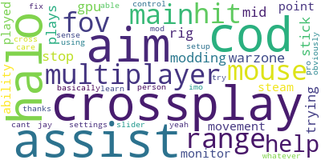
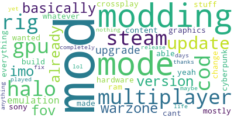
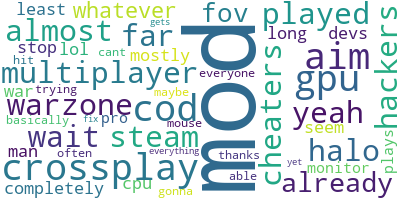

<h1>PC verus Console: webscraping, aspect-based sentiment analysis, and topic modeling</h1>


<h2>Description</h2>
This project aims to explore the common gaming debate between using a PC versus a Console. Using APIs, we scraped comments from popular subreddits and youtube videos on the subject. After cleaning and wrangling the data, we applied a common aspect-based sentiment model (deberta-v3-base-absa) to the comments. We then created a methodolgy to group comments into "pro console," "pro pc," and "neutral" comments. From there we used Top2Vec to model topics within each category. 
<br />

<h2>Language and Packages Used</h2>

  - <b>Python</b> 
    - <b>pandas</b>
    - <b>googleapiclient.discovery</b>
    - <b>transformers</b>
    - <b>torch</b>
    - <b>top2vec</b>
    - <b>seaborn</b>
    - <b>matplotlib</b>
    - <b>re</b>
    - <b>wordcloud</b>
    - <b>gensim</b>
    - <b>nltk</b>


<h2>Project Overview and Highlights:</h2>

**1) Scrape comments from youtube and reddit [View the code](web_scraping_scripts/)**
  - Youtube videos:
    - [PC vs Console in 2024... time to ditch PC?](https://www.youtube.com/watch?v=GgJj9Mok9dA)
    - [Finally ENDING the PC Gaming vs Console Debate](https://www.youtube.com/watch?v=4BXOa7Eqzxc)
    - [PC Gaming vs Console - What’s ACTUALLY Better? 🤔](https://www.youtube.com/watch?v=Ko8ubyWDy58)
    - [Call of Duty Warzone is not fair ( PC vs Console )](https://www.youtube.com/watch?v=uMBEvgiKqBs)
 
  - Subreddits:
    -  we scraped from 30+ subreddits (general pc vs console debate, game specific: Halo, Call of Duty, Cyberpunk). All URLs are included in the [reddit_scraping.py](web_scraping_scripts/reddit_scraping.py) file.

  -  Click [here](data/) for scraped data in csv format

**2) Apply aspect-based sentiment model [DeBERTa v3](https://huggingface.co/yangheng/deberta-v3-base-absa-v1.1) to comments. See code [here](aspect_based_sent.py)**
  - We combined and wrangled data. We also found synonyms for "console," such as "ps5," or "playstation" and changed them to be "console"
  - We created 2 functions to implement this model: one where "console" was the aspect, one where "pc" was the aspect
      - example of "console" function:
        ```python
        # Load Aspect-Based Sentiment Analysis model
        from transformers import AutoTokenizer, AutoModelForSequenceClassification
        tokenizer = AutoTokenizer.from_pretrained("yangheng/deberta-v3-base-absa-v1.1")
        model = AutoModelForSequenceClassification.from_pretrained("yangheng/deberta-v3-base-absa-v1.1")

        #create a funciton to assign prob of sentiment w regards to console
        def get_probabilities_console(row):
            text = str(row['text']).lower()
            inputs = tokenizer(f"[CLS] {text} [SEP] {'console'} [SEP]", return_tensors="pt")
            with torch.no_grad():
                outputs = model(**inputs)
            probs = F.softmax(outputs.logits, dim=1).detach().numpy()[0]
            return pd.Series(probs, index=["console_negative", "console_neutral", "console_positive"])

        # Apply the function to each row
        probabilities_test_con = all_comments.apply(get_probabilities_console, axis=1)

**3) Group comments into 3 categories using ABSM scores: Pro PC, Pro Console, Neutral. See code [here](topic_modeling.py)**
  - We created a function that sums probabilites as follows:
      - Pro PC (positive pc score + negative console score)
      - Pro Console (positive console score + negative pc socre)
      - Neutral (neutral console score + neutral pc score)
  - This function assigns the comment to the max summative score. There is theresholding in place to assign neutral less frequently
  - function:
      ```python
      def group_probabilites(row):
      pro_console_score = row['console_positive'] + row['pc_negative'] 
      pro_pc_score = row['pc_positive'] + row['console_negative']
      neutral_score = row['pc_neutral'] + row['console_neutral']
    
      sentiment_dict = {
          'pro_console' : pro_console_score,
          'pro_pc': pro_pc_score,
          'neutral' : neutral_score
          }

      max_sent = max(sentiment_dict, key=sentiment_dict.get)

      # If the max sentiment is neutral, check the differences
      if max_sent == 'neutral':
          difference_pro_pc = abs(neutral_score - pro_pc_score)
          difference_pro_console =  abs(neutral_score - pro_console_score)
        
      # Check if the differences are less than 0.4
      if difference_pro_pc < 0.4 or difference_pro_console < 0.4:
            # Remove 'neutral' from the dictionary and return the next highest sentiment
            sentiment_dict.pop('neutral')
            return max(sentiment_dict, key=sentiment_dict.get)
    
    return max_sent

    # apply function
    all_comments_prob['comment_type'] = all_comments_prob.apply(group_probabilites, axis=1)


  - Visualizations:
<p align="center">
<br />
<br />
<br />
<br />
<br />
<p align="left">
    - Expand data based on likes. Each comment is counted the same number of times as it has likes (if in the case of a negative like count(reddit), the comment just counts once.

<p align="center">
<br />
<br />
(With like weighting, pro-console opinions take the lead)
<br />
<br />
<br />

<p align="left">
- side by side boxplots of word count
<p align="center">
<br />
<br />
(The topic modeling we are going to implement does better on shorter texts. We will aim to get rid of comments longer than 400 words. First we want to take a look at like count to make sure we are not filtering any popular comments)
<br />
<br />
<br />
<p align="left">
- side by side boxplots of like count
<p align="center">
<br />
<br />
(We will filter comments that have word count > 400 and like count < 15)
<br />
<br />
<br />
<p align="left">
- side by side boxplots of filtered data
<p align="center">
<br />
<br />
<br />
<br />
<br />
<p align="left">
  
**4) Process Text and Remove Stopwords**
  -  We used nltk's "english" stop word package and nltk's opinion lexicons (both positive and negative)
  -  We also did an iterative process of looking through most frequent words, wordclouds, and reviewing topic models to remove specific stop words such as "player", "gamer", "controller", ect.

**5) Create topic models for each comment type using Top2Vec and generate wordclounds to visualize topics**
  - We used Top2Vec because it does better with shorter texts and also does not need predetermined number of topics. LDA was also tested, but performed worse (most likley due to the length of comments)
  - example code (for pc topic modeling):
   ```python
    ## topic model for each corpus
    pc_model = Top2Vec(documents=pc_corpus, speed="learn", workers=8)

    pc_model.get_num_topics()

    pc_model.hierarchical_topic_reduction(num_topics=5)

    pc_topic_sizes, pc_topic_nums = pc_model.get_topic_sizes()


    pc_topic_words, pc_word_scores, pc_topic_nums = pc_model.get_topics(3)

    #create wordclouds
    for idx, pc_topic in enumerate(pc_topic_nums):
        # Get the words for the current topic
        words = pc_topic_words[idx]

        # Join the words into a long string for the word cloud
        long_string = ' '.join(words)

        # Create and generate the word cloud
        wordcloud = WordCloud(background_color="white", max_words=100, contour_width=3, contour_color='steelblue')
        wordcloud.generate(long_string)

        # Save the word cloud with a unique file name
        file_name = f'wordcloud_pctopic_{pc_topic}.png'
        wordcloud.to_file(f'/Users/leahboger/Documents/web_scraping/{file_name}')

        wordcloud.to_image()
```

- Visualizations:
<p align="left">
    - Pro PC Wordclouds
<br />
These suggest that people who like PCs (or don't like Consoles) focus on functionality ("mouse", "assist", ect.), customizability ("modding", "build", ect.), and being able to interact with other users ("crossplay", "multiplayer", ect.)
<p align="center">
<br />
<br />
Topic 1
<br />
<br />
<br />
Topic 2
<br />
<br />
<br />
Topic 3
<br />
<br />
<p align="left">
    - Pro Console Wordclouds
<br />
This suggest that people who like Consoles (or don't like PCs) focus on interaction with others("crossplay", "multiplayer", ect.). Interestingly a focus also seems to be on legitimacy of playing using words like "cheaters" or "hackers." This is a common critque of PC users (that it is cheating to use a PC to play people using a console)
<p align="center">
<br />
<br />
Topic 1
<p align="left">

<h2>Conclusions:</h2>
With our fairly limited sample size (data was about 23,000 rows), it seems that the debate is fairly even. When accounting for likes, pro-console opinions take a slight lead. Using topic modeling, we found the Pro-PC users value interaction with other users, functionality, and customizability. Pro-console users also value interaction, but also focus on legitamcy of each platform (using terms like "cheater"). These values and opinions could help determine how to market new gaming technology more effectively.

<h2>Sources:</h2>

  - Youtube Scraping:
    - [analyticswithadam (github)](https://github.com/analyticswithadam/Python/blob/main/YouTube_Comments_Advanced.ipynb)
 
  - Reddit Scraping:
    - [parth647 (github)](https://github.com/parth647/reddit_scraping_using_praw/blob/master/python_reddit_scrapy.py)

  - Aspect-Based Sentiment Analysis:
    - [mounishvatti (github)](https://github.com/mounishvatti/SteamScrape)
    - [Tokenization in Sentiment Analysis (medium)](https://medium.com/@felixmutai/tokenization-in-sentiment-analysis-cd386a08fab)
    - [How to Monitor Sentiment in Gaming](https://www.affogata.com/blog/how-to-monitor-sentiment-in-gaming/)
    - [Quick intro to Aspect-Based Sentiment Analysis](https://medium.com/nlplanet/quick-intro-to-aspect-based-sentiment-analysis-c8888a09eda7)

  - Topic Modeling:
    - [parth647 (github)](https://github.com/parth647/reddit_scraping_using_praw/blob/master/python_reddit_scrapy.py)

    
